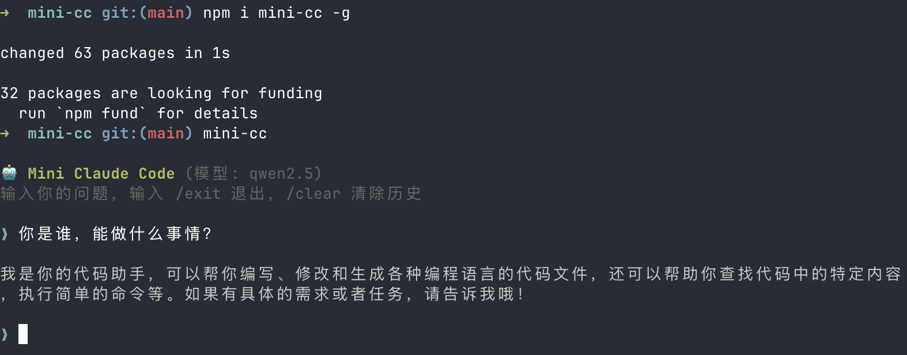

# Mini Claude Code (mini-cc)

[](https://github.com/Sunny-117/mini-cc/releases/tag/v0.1.2) [](https://www.npmjs.com/package/mini-cc)

🤖 一个基于本地 Ollama 模型的代码助手 CLI 工具。集成 LangChain.js，使用模型原生 tool calling 能力实现可靠的工具调用。



## 前置要求

- **Node.js** >= 18
- **Ollama** 已安装并运行

## 安装

```bash
npm install -g mini-cc
```

## 快速开始

### 1. 安装 Ollama 和模型

```bash
# 安装 Ollama（macOS）
brew install ollama

# 启动 Ollama 服务
ollama serve

# 拉取默认模型
ollama pull qwen2.5
```

### 2. 运行

```bash
mini-cc
```

### 从源码开发

```bash
# 克隆仓库
git clone https://github.com/Sunny-117/mini-cc.git
cd mini-cc

# 安装依赖
pnpm install

# 开发模式（推荐，直接运行 TypeScript）
pnpm dev

# 或者先编译再运行
pnpm build
pnpm start
```

## 使用方式

### 交互式聊天（默认）

```bash
pnpm dev
```

进入交互式对话，可以连续提问：

```
🤖 Mini Claude Code (模型: qwen2.5)
输入你的问题，输入 /exit 退出，/clear 清除历史

❯ 列出当前目录的文件
  🔧 调用工具: list_files {"pattern":"*"}
  📋 结果: docs.md
            package.json
            src
            tsconfig.json

当前目录包含以下文件: ...

❯ 读取 package.json 的内容
  🔧 调用工具: read_file {"path":"package.json"}
  📋 结果: { "name": "mini-cc", ... }

package.json 的内容如下: ...

❯ /clear
对话历史已清除。

❯ /exit
再见！👋
```

### 单次提问

```bash
# 通过编译后的入口
node dist/index.js ask "这个项目用了哪些依赖？"

# 或通过 tsx
npx tsx src/index.ts ask "帮我创建一个 hello.ts 文件"
```

### 交互命令

| 命令 | 说明 |
|------|------|
| `/exit` 或 `/quit` | 退出程序 |
| `/clear` | 清除对话历史 |

## 配置

### 命令权限控制

默认情况下，所有 shell 命令执行前都需要用户确认。在项目根目录创建 `.mini-cc.json` 可配置命令白名单：

```json
{
  "allowedCommands": ["ls", "cat", "git status", "git diff", "git log"]
}
```

- 白名单采用**前缀匹配**，如 `"ls"` 可匹配 `ls -la`、`ls src/`
- 白名单内的命令自动执行，白名单外的命令会提示用户确认：

```
⚠️  即将执行命令: npm install
  是否允许执行？(y/N)
```

- 不创建配置文件时，所有命令都需要确认

### 切换模型

通过环境变量 `MINI_CC_MODEL` 指定模型（需支持原生 tool calling）：

```bash
MINI_CC_MODEL=qwen2.5:14b pnpm dev
MINI_CC_MODEL=llama3.1 pnpm dev
MINI_CC_MODEL=mistral pnpm dev
```

默认模型：`qwen2.5`

### 自定义 Ollama 地址

通过环境变量 `OLLAMA_HOST` 指定 Ollama 服务地址：

```bash
OLLAMA_HOST=http://192.168.1.100:11434 pnpm dev
```

默认地址：`http://127.0.0.1:11434`

## 内置工具

Agent 在对话中可以自动调用以下工具：

| 工具 | 功能 | 限制 |
|------|------|------|
| `read_file` | 读取文件内容 | 最大 100KB |
| `write_file` | 创建新文件 | 仅限工作目录内 |
| `edit_file` | 精准编辑现有文件（diff/patch 式替换） | 需匹配唯一文本 |
| `list_files` | glob 模式列出文件 | 排除 node_modules/.git/dist |
| `search_code` | 搜索代码文本 | 最多 50 条结果 |
| `run_command` | 执行 shell 命令 | 30 秒超时，需用户确认 |

## 项目结构

```
mini-cc/
├── src/
│   ├── index.ts            # 入口
│   ├── config.ts           # 配置文件加载（.mini-cc.json）
│   ├── permission.ts       # 命令权限确认
│   ├── cli/index.ts        # CLI 交互
│   ├── agent/
│   │   └── agent.ts        # LangGraph ReAct Agent
│   ├── tools/
│   │   ├── readFile.ts     # read_file
│   │   ├── writeFile.ts    # write_file
│   │   ├── editFile.ts     # edit_file
│   │   ├── listFiles.ts    # list_files
│   │   ├── searchCode.ts   # search_code
│   │   ├── runCommand.ts   # run_command
│   │   └── index.ts        # 工具导出
│   └── llm/ollama.ts       # ChatOllama 封装
├── .mini-cc.json           # 可选配置文件
├── docs/                   # 设计文档
├── package.json
└── tsconfig.json
```

## 开发

```bash
# 编译
pnpm build

# 开发模式运行
pnpm dev

# 编译后运行
pnpm start
```

## 技术栈

- **TypeScript** + **Node.js** (ESM)
- **LangChain.js** — LLM 框架（`@langchain/core`, `@langchain/ollama`）
- **LangGraph** — Agent 编排（`@langchain/langgraph`，`createReactAgent`）
- **Ollama** — 本地 LLM 推理
- **Zod** — 工具参数 schema 定义
- **Commander** — CLI 框架
- **chalk** + **ora** — 终端 UI

## 文档

详细设计文档位于 `v2-langchain-docs/` 目录：

- [架构设计](v2-langchain-docs/architecture.md)
- [Agent 核心设计](v2-langchain-docs/agent.md)
- [工具系统设计](v2-langchain-docs/tools.md)
- [项目结构说明](v2-langchain-docs/project-structure.md)

## 历史版本：通过 ReAct 循环实现智能工具调用

- [v0.1.2](https://github.com/Sunny-117/mini-cc/releases/tag/v0.1.2)  - 一个基于本地 Ollama 模型的代码助手 CLI 工具。支持文件读写、代码搜索、命令执行等能力，通过 ReAct 循环实现智能工具调用。
